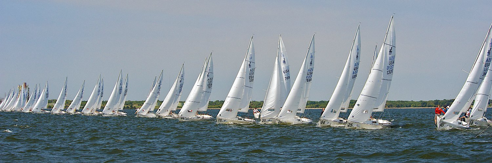

# About David Finster

  

I'm a coffee geek, expert sailor, and not a great guitar player. I'm also the Technical Editor and Developer Advocate at [Vultr.com](https://www.vultr.com).  

If you have a question about Vultr's infrastructure or the [Trusted Author Program](https://www.vultr.com/docs/trusted-author-program), email [dfinster@vultr.com](mailto:dfinster@vultr.com), or look for me on:

* [GitHub - @dfinr](https://github.com/dfinr)
* [Twitter - @dfinr](https://twitter.com/dfinr)
* [Reddit - /u/dfinr](https://www.reddit.com/user/dfinr)
* [Keybase - A024 231D BF7B 506B](https://keybase.io/dfinr)
* [Stack Exchange](https://stackexchange.com/users/18149210/david-finster?tab=accounts)
* [Twitch](https://www.twitch.tv/dfinr)
* [LinkedIn](https://www.linkedin.com/in/dfinr/)
